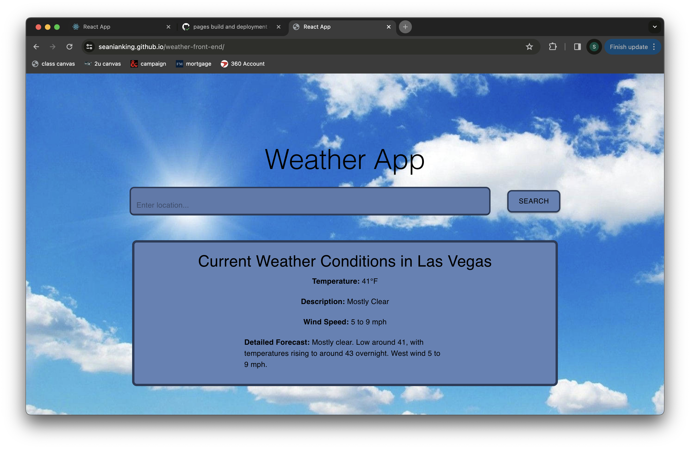

# React Weather App Front End

## Application Use

To use the application, simply go to the deployed application at [Deployed Application](https://seanianking.github.io/weather-front-end/) and input a city, state, or county name and click to search. The information for your search will be populated below the search area.

## Error Handling

If the input information is not found by the API then an error message will be displayed instead of the box with weather information.

## License and Other Information

This project is licensed under the MIT license. 

This project was bootstrapped with [Create React App](https://github.com/facebook/create-react-app).
